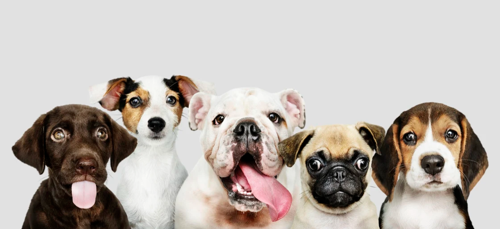

# Title: Dog breed classification app

## Project Description 

Dogs are some of the most lovable and adorable creatures. According to FCI (http://www.fci.be/en/) , there are more than 300 officially recognized dog breeds. However, most people are familiar only with the most popular breeds, such as German Shepard or Labrador Retriever. 

The model I intend to build could be used in an app, which will let the user know the dog’s breed after uploading an image. First, it would be necessary to import the human face dataset. The app will detect a human face and match it with the breed it resembles the most. It sounds funny, but I think that’s how it is supposed to work. The next step would be to import the dog’s dataset and train the neural networks to detect the dogs based on input images. After that, I will train a model to classify a dog’s breed. Lastly, it would be essential to test the algorithm and see its accuracy. The goal is to have at least 85% accuracy classification. 

## Project Goals 

1. Import the required dataset.
2. Write code to detect human face based on the input image.
3. Write code to detect dog based on the input image.
4. Create and train NN for classifying dog’s breed. 
5. Test the NN for its accuracy.
